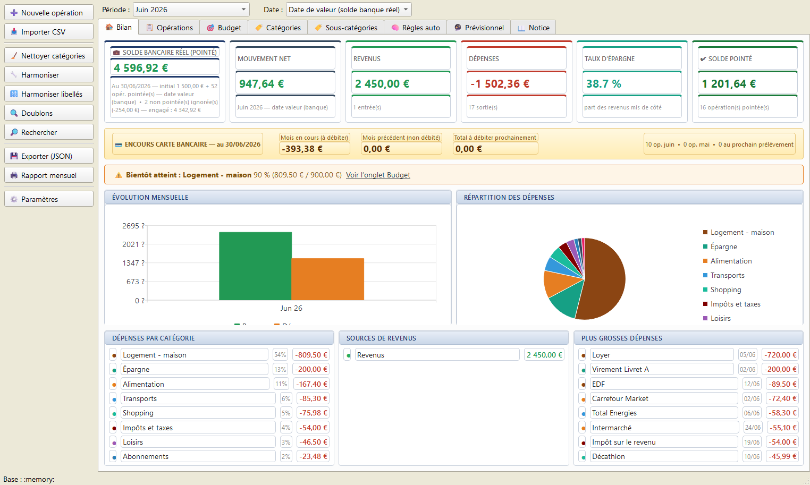
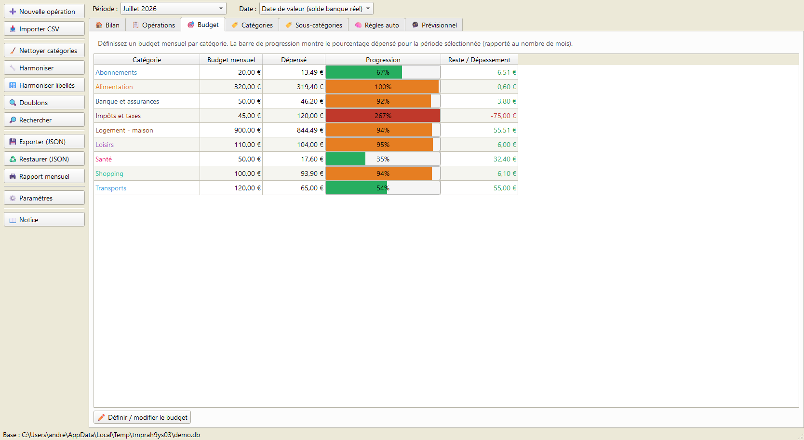
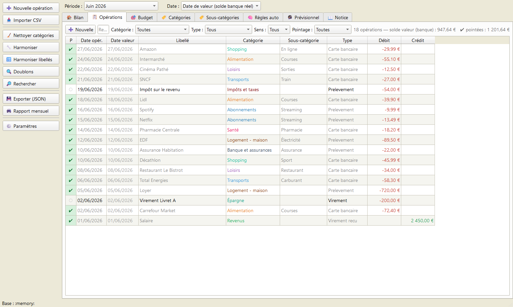
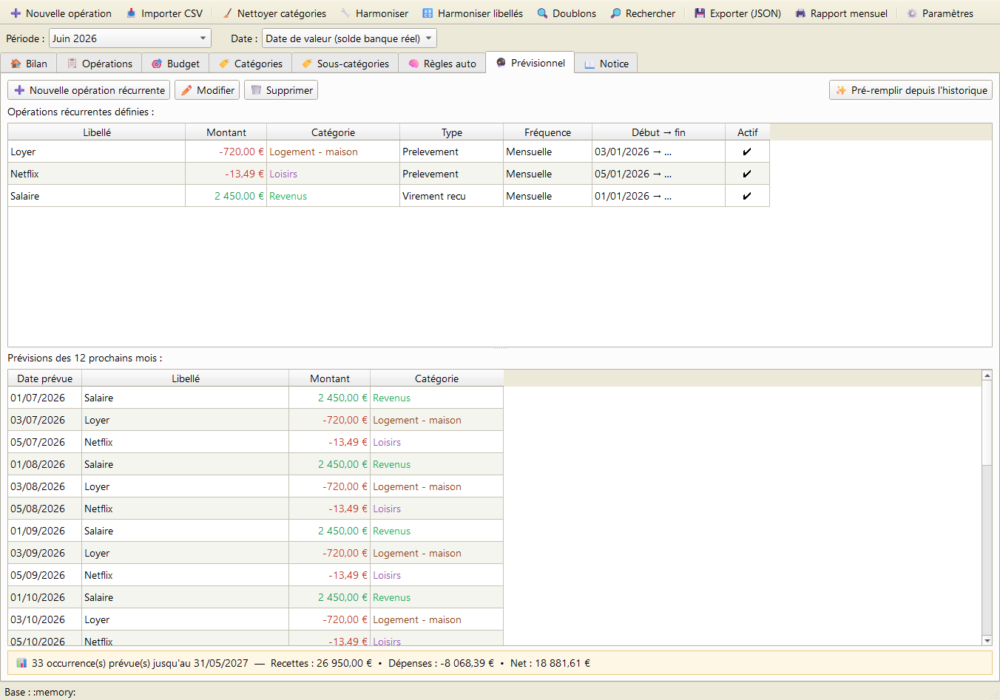
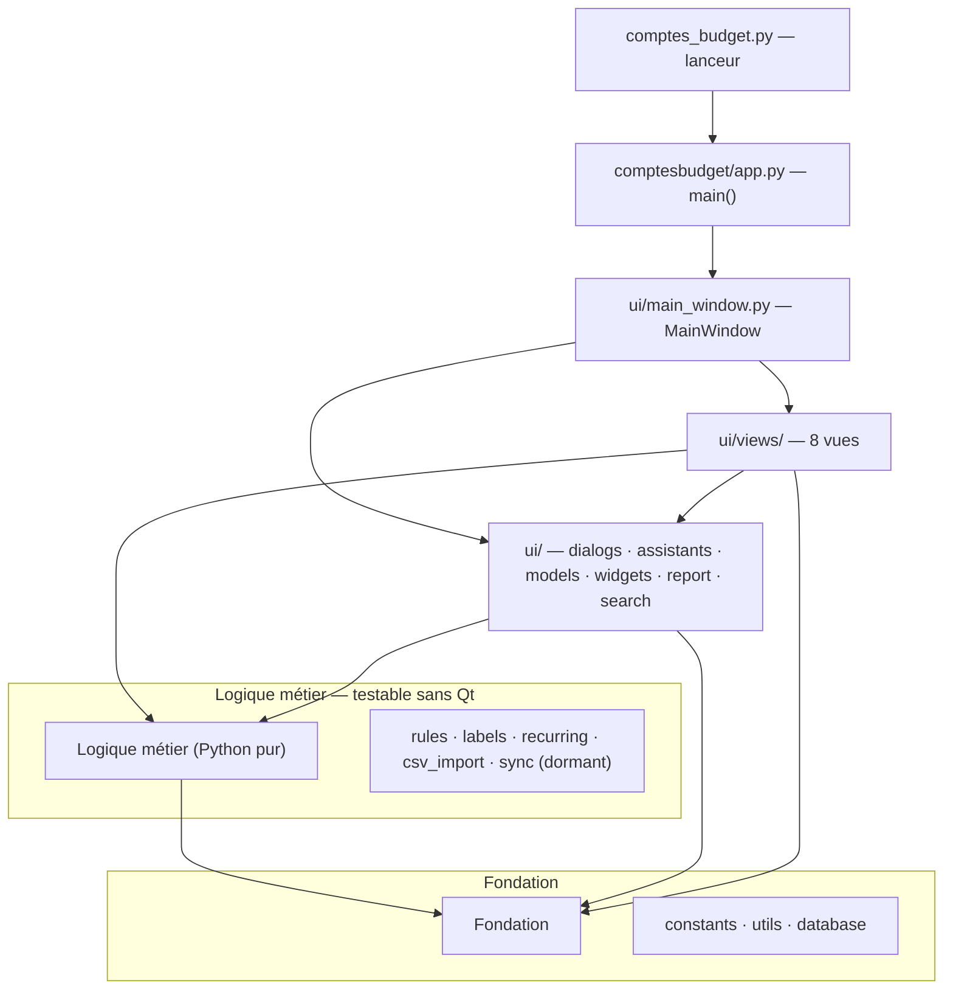

# Comptes et Budget

[](https://github.com/andre12230-png/Comptes-Budget/releases)
[](https://github.com/andre12230-png/Comptes-Budget/releases/latest)
[](LICENSE)

> 📥 **Télécharger pour Windows 10/11** — [page de présentation](https://andre12230-png.github.io/Comptes-Budget/) · [dernière version (.zip)](https://github.com/andre12230-png/Comptes-Budget/releases/latest) · [itch.io](https://andre12230.itch.io/comptes-et-budget)

> 📦 Ou en ligne de commande avec **[Scoop](https://scoop.sh)** : `scoop install https://raw.githubusercontent.com/andre12230-png/Comptes-Budget/main/bucket/comptes-budget.json`

Application de bureau pour la **gestion de comptes et de budget personnels** :
suivi des opérations, catégorisation automatique, budgets mensuels, prévisionnel
des opérations récurrentes, rapports et rapprochement bancaire.

Interface **PySide6 (Qt)**, données stockées en **SQLite** local. C'est un portage
Python de l'ancienne application HTML/JS (archivée dans [`archive/`](archive/)).

> Version applicative : **1.10.1**

---

## Aperçu

| | |
|:---:|:---:|
|  |  |
|  |  |

*Captures réalisées avec des données d'exemple.*

## Fonctionnalités

L'application s'organise en onglets :

| Onglet | Rôle |
|---|---|
| 🏠 **Bilan** | Tableau de bord : soldes, KPIs, alertes budget, graphiques, top dépenses |
| 📋 **Opérations** | Liste filtrable des transactions, pointage, édition, doublons |
| 🎯 **Budget** | Budgets par catégorie avec barres de progression |
| 🏷️ **Catégories** | Exploration par catégorie (drill-down), recatégorisation en masse |
| 🏷️ **Sous-catégories** | Tri, fusion, renommage, nettoyage des sous-catégories |
| 🧠 **Règles auto** | Règles de catégorisation automatique (motif → catégorie) |
| 🔮 **Prévisionnel** | Opérations récurrentes et projection des prochains mois |
| 📖 **Notice** | Mode d'emploi et glossaire intégrés |

Autres outils : **import CSV** des relevés bancaires (BPCE / CM / CA, encodage
windows-1252), **harmonisation** des catégories et libellés, **recherche globale**
(Ctrl+F), **rapport mensuel** imprimable / PDF, et **sauvegarde quotidienne
automatique** de la base.

---

## Installation et lancement

**Prérequis :** Python ≥ 3.9 (les annotations `list[...]` l'exigent ; développé
et testé avec 3.13 / 3.14) et la dépendance **PySide6**.

```bash
pip install PySide6
```

**Lancer l'application :**

```bash
python comptes_budget.py
```

Sous Windows, on peut aussi double-cliquer sur
[`Lancer-Comptes-Budget.bat`](Lancer-Comptes-Budget.bat) (utilise `pythonw.exe`
pour éviter la console noire), ou lancer le package directement :

```bash
python -m comptesbudget
```

---

## Construction d'un exécutable autonome

Le script [`Construire-Exe.bat`](Construire-Exe.bat) produit un `.exe` autonome
(~100 Mo) via **PyInstaller** :

```bash
python -m PyInstaller --noconfirm --onefile --windowed ^
    --name "Comptes-Budget" --icon Budget.ico --add-data "Budget.ico;." ^
    --collect-submodules PySide6 comptes_budget.py
```

Le point d'entrée reste `comptes_budget.py` : PyInstaller suit l'import du package
et embarque automatiquement tout `comptesbudget/`.

---

## Architecture du projet

Le code est organisé en un **lanceur léger** (`comptes_budget.py`) et un **package
`comptesbudget/`** découpé en couches. Les dépendances sont **strictement
descendantes (graphe acyclique)** : l'interface dépend de la logique, qui dépend
de la fondation — jamais l'inverse.



### Arborescence

```
comptes_budget.py            Lanceur (point d'entrée des .bat et de PyInstaller)
comptesbudget/
├── __init__.py
├── __main__.py              Permet « python -m comptesbudget »
├── app.py                   main() : QApplication, palette, lancement
│
│   ── Fondation (Python pur, sans Qt) ──
├── constants.py             Catégories, couleurs, règles d'harmonisation,
│                            fréquences, chemins, numéro de version
├── utils.py                 Dates, formatage €, normalisation, sauvegarde
├── database.py              class Database (schéma + accès SQLite)
│
│   ── Logique métier (Python pur, sans Qt) ──
├── rules.py                 Auto-catégorisation (matches_rule, apply_rules_to_tx)
├── labels.py                Nettoyage et profilage des libellés
├── recurring.py             Occurrences récurrentes + détection automatique
├── csv_import.py            Import des relevés bancaires CSV
├── sync.py                  Moteur de fusion (LWW) — DORMANT, conservé
│
└── ui/                      ── Interface (PySide6/Qt) ──
    ├── models.py            TxTableModel (modèle de table)
    ├── widgets.py           PeriodBar (sélecteur de période)
    ├── dialogs.py           Édition : transaction, réglages, règle, récurrence
    ├── assistants.py        Harmonisation, pré-remplissage du prévisionnel
    ├── report.py            Rapport mensuel (HTML, aperçu, PDF, impression)
    ├── search.py            Recherche globale (Ctrl+F)
    ├── main_window.py       MainWindow : assemble onglets et barre d'outils
    └── views/
        ├── operations.py    Vue Opérations
        ├── bilan.py         Vue Bilan
        ├── budget.py        Vue Budget
        ├── categories.py    Vue Catégories
        ├── subcategories.py Vue Sous-catégories
        ├── previsionnel.py  Vue Prévisionnel
        ├── rules_view.py    Vue Règles auto
        └── notice.py        Vue Notice
```

### Couches

1. **Fondation** (`constants`, `utils`, `database`) — données de configuration,
   utilitaires et accès SQLite. Aucune dépendance vers le reste.
2. **Logique métier** (`rules`, `labels`, `recurring`, `csv_import`, `sync`) —
   pur Python, **testable sans interface graphique**. Ne dépend que de la fondation.
3. **Interface** (`ui/`) — widgets, dialogues et vues PySide6. La fenêtre
   principale assemble les huit vues ; aucune vue n'en instancie une autre.

---

## Données et fichiers

Tout est stocké **à côté du lanceur** (ou de l'`.exe` en mode gelé) :

| Fichier / dossier | Contenu | Versionné ? |
|---|---|---|
| `comptes.db` | Base SQLite (opérations, budgets, règles, récurrences, réglages) | non (données perso) |
| `sauvegardes/` | Copies quotidiennes automatiques de la base (rotation sur 10 jours) | non |
| `comptes_sync.json` | Fichier d'échange historique (lié au moteur dormant `sync.py`) | non |
| `Budget.ico` | Icône de l'application | oui |
| `archive/` | Ancienne application HTML/JS d'origine | oui |

La sauvegarde quotidienne est effectuée **au lancement, avant l'ouverture de la
base** : même une migration ratée ne peut pas abîmer la copie du jour.

---

## Notes de développement

- **Module `sync.py` dormant** : le moteur de fusion par enregistrement
  (*last-write-wins*) n'est plus câblé à l'interface depuis la v1.9.5 (retrait de
  l'app HTML et de sa synchronisation). Il est conservé pour pouvoir
  réimporter / fusionner un fichier d'échange JSON si besoin.
- **Couche métier testée** : `rules`, `labels`, `recurring`, `csv_import` et
  `database` s'importent et s'exécutent sans Qt. Une suite de tests unitaires
  (`tests/`) couvre le formatage, l'auto-catégorisation, les occurrences
  récurrentes, le nettoyage des libellés et l'import CSV (dédoublonnage compris).
  La couche UI (PySide6) est couverte par des *smoke tests* : chaque vue et
  dialogue est construit en mode « offscreen » puis rafraîchi, pour détecter
  les plantages et erreurs de câblage sans serveur d'affichage.

  ```bash
  pip install -r requirements-dev.txt
  pytest
  ```
- **Qualité** : le code passe `ruff` (jeu de règles *pyflakes* F : aucun import
  manquant, aucun nom non défini, aucun import inutilisé).

  ```bash
  ruff check comptesbudget
  ```

---

## Licence

Distribué sous licence **MIT** — voir le fichier [`LICENSE`](LICENSE). Vous êtes
libre d'utiliser, modifier et redistribuer ce logiciel, y compris à des fins
commerciales, à condition de conserver la mention de copyright.

> ⚠️ **Confidentialité** : aucune donnée personnelle n'est incluse dans ce dépôt.
> La base `comptes.db` est créée vide au premier lancement et reste sur votre
> machine. Elle n'est jamais versionnée (voir `.gitignore`).
